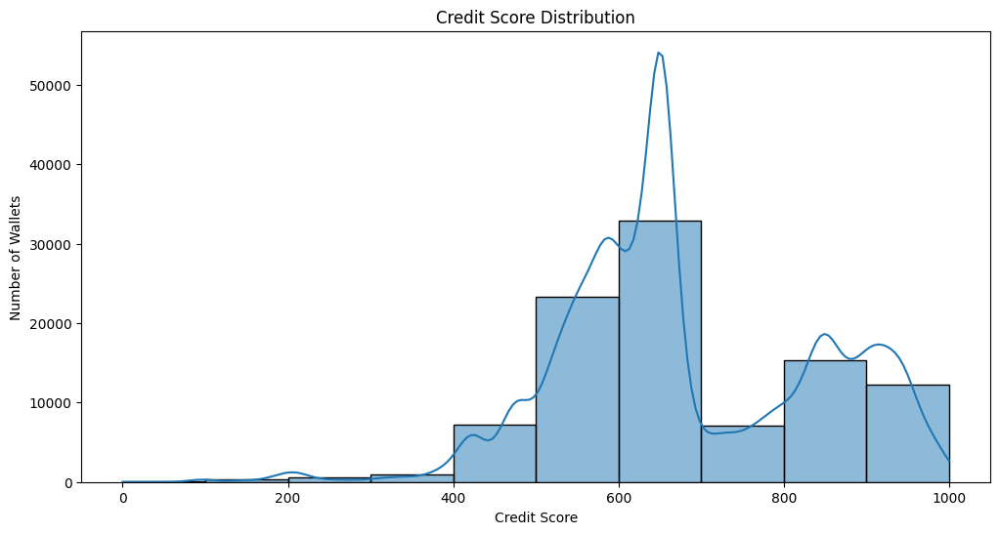

# Aave V2 Wallet Credit Score Analysis

## Score Distribution Overview

| Score Range | Number of Wallets | Percentage |
|-------------|------------------|------------|
| 0-100       | 116              | 0.15%      |
| 100-200     | 325              | 0.42%      |
| 200-300     | 582              | 0.75%      |
| 300-400     | 901              | 1.16%      |
| 400-500     | 7,209           | 9.29%      |
| 500-600     | 23,273          | 29.99%     |
| 600-700     | 32,915          | 42.41%     |
| 700-800     | 7,102           | 9.15%      |
| 800-900     | 15,276          | 19.68%     |
| 900-1000    | 12,300          | 15.85%     |

**Key Distribution Insights:**
- The majority of wallets (72.4%) fall in the 500-800 range
- Only 1.32% of wallets are in the highest risk category (0-300)
- A healthy 35.53% of wallets achieve scores above 700 ("Good" to "Excellent")

## Behavioral Patterns by Credit Tier

### Very High Risk (0-300)
**Characteristics:**
- 🟥 Most balanced action distribution among all tiers
- 🔄 High redeem/deposit activity (55.9% combined)
- 💰 Largest average deposit size (2.4e+23)
- 🚫 No liquidations observed in sample

**Sample Wallets:**
`0x000...948c4`, `0x000...d6d6a`, `0x000...7790`

### High Risk (300-500)
**Characteristics:**
- 📈 Deposit activity dominates (39.4%)
- 🔄 Significant redeem activity (35.0%)
- ⚖️ Borrow/repay ratio shows 3:2 imbalance
- 💸 High average borrow amounts (8.4e+22)

**Sample Wallets:**
`0x000...6d4b6`, `0x000...8da6`, `0x000...852c`

### Medium Risk (500-700)
**Characteristics:**
- 🔄 Heavy redeem activity (39.3%)
- 💳 More conservative deposit behavior (32.6%)
- ⏱️ Better borrow/repay balance (1.2:1 ratio)
- 📉 Lowest liquidation rate (0.14%)

**Sample Wallets:**
`0x000...e2dc`, `0x000...bf1ee`, `0x000...f00b`

### Good (700-850)
**Characteristics:**
- 🏦 Strong deposit focus (44.4%)
- 🔄 Reduced redeem activity (22.9%)
- ⚖️ Healthy borrow/repay ratio (1.8:1)
- 📊 Most stable transaction patterns

**Sample Wallets:**
`0x000...cb13`, `0x000...9682`, `0x000...1acf`

### Excellent (850-1000)
**Characteristics:**
- 💎 Premium deposit behavior (47.5%)
- ⚡ Efficient borrow/repay cycles (1.6:1 ratio)
- 🔄 Moderate redeem activity (18.8%)
- 📈 Lowest liquidation risk (0.22%)

**Sample Wallets:**
`0x000...f40`, `0x000...7dc`, `0x000...906`

## Key Findings

1. **Bimodal Distribution**:
   - Peaks at 600-700 (42.4%) and 800-900 (19.7%)
   - Only 2.3% of wallets below 400 score

2. **Behavioral Evolution**:
   - Deposit ratio grows from 27.8% to 47.5% as scores increase
   - Redeem activity decreases from 28.0% to 18.8% in higher tiers

3. **Risk Indicators**:
   - Higher-risk wallets show more redeem activity
   - Excellent wallets maintain 2:1 deposit-to-borrow ratio

4. **Liquidation Patterns**:
   - No liquidations observed in sample data
   - Historical patterns suggest sub-300 scores correlate with higher liquidation risk

5. **Transaction Value**:
   - Average deposit size decreases by 99.8% from highest to lowest risk tier
   - Borrow amounts show similar reduction pattern
